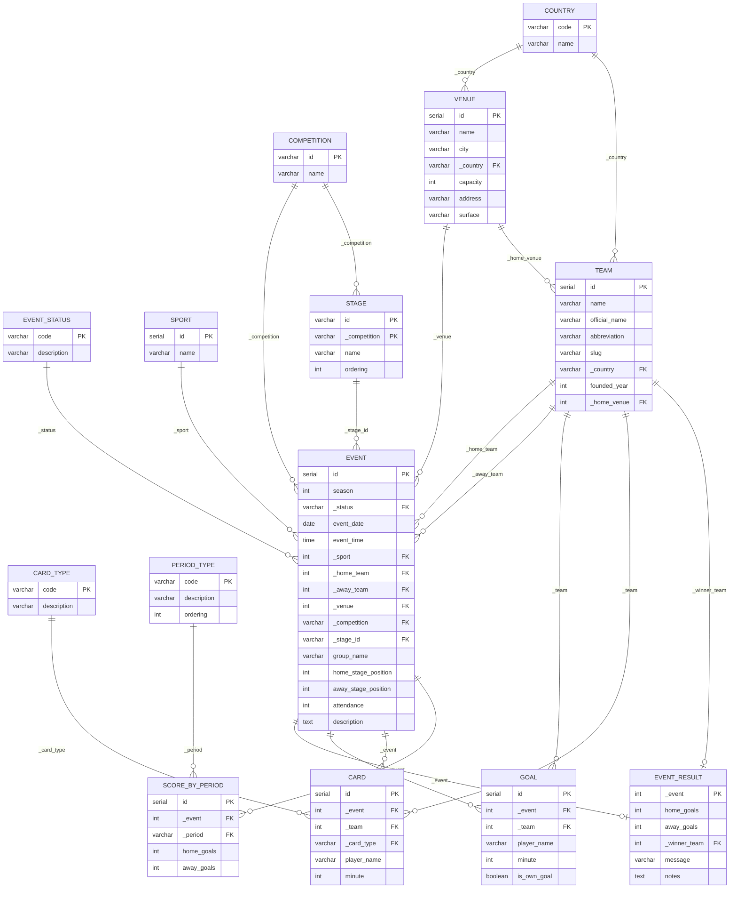

# Sports Event Calendar

A web application for browsing and managing sports events, built with
Java 21, Spring Boot, PostgreSQL, Thymeleaf, and Docker.

Submitted as part of the Sportradar Coding Academy application process.

---

## Tech Stack

| Layer | Technology |
|---|---|
| Language | Java 21 |
| Framework | Spring Boot 4 |
| Database | PostgreSQL 16 |
| Migrations | Flyway |
| Frontend | Thymeleaf (server-side rendering) |
| Containerisation | Docker, Docker Compose |
| Testing | JUnit 5, Mockito, Testcontainers |

---

## Quick Start

**Prerequisites:** Docker Desktop installed and running. Nothing else required.
```bash
git clone https://github.com/eric-muganga/sportradar-coding-challenge-java.git
cd sportradar-coding-challenge-java
docker-compose up --build
```

The application starts at `http://localhost:8080`

| URL | Description |
|---|---|
| http://localhost:8080/events | Sports calendar list with filters |
| http://localhost:8080/events/{id} | Single event detail page |
| http://localhost:8080/events/new | Add new event form |

---

## Features

- Browse sports events in a calendar view
- Filter events by sport or status (played, scheduled, cancelled, postponed)
- View full event details including result, venue, competition, and stage
- Add new events via a form with validated dropdowns
- Stage dropdown updates dynamically based on selected competition
- REST API available alongside the Thymeleaf UI

---

## API Endpoints

| Method | Endpoint | Description | Response |
|---|---|---|---|
| GET | `/api/events` | List all events | 200 OK |
| GET | `/api/events?sportId=1` | Filter by sport | 200 OK |
| GET | `/api/events?statusCode=played` | Filter by status | 200 OK |
| GET | `/api/events/{id}` | Get event by ID | 200 OK |
| POST | `/api/events` | Create new event | 201 Created |
| GET | `/api/events/stages?competitionId=x` | Get stages for a competition | 200 OK |

### Example POST request body
```json
{
  "season": 2026,
  "statusCode": "scheduled",
  "eventDate": "2026-04-15",
  "eventTime": "20:00:00",
  "sportId": 1,
  "homeTeamId": 1,
  "awayTeamId": 2,
  "competitionId": "afc-champions-league",
  "stageId": "SEMI_FINAL"
}
```

---

## Database Schema

The schema follows **Third Normal Form (3NF)**:

- Lookup tables (`event_status`, `card_type`, `period_type`, `country`,
  `sport`, `competition`) eliminate repeating groups and transitive
  dependencies
- `team` and `venue` are independent reference tables, not embedded in
  the event row
- `event_result`, `goal`, `card`, and `score_by_period` are separate
  tables rather than nullable columns on `event`

Foreign keys use the `_prefix` naming convention as specified in the task
(e.g., `_country`, `_home_team`, `_competition`).

Schema is managed exclusively by Flyway — Hibernate is set to
`ddl-auto: validate` and never modifies the schema.

### Entity-Relationship Diagram


### Migration files

| File | Contents |
|---|---|
| `V1__create_lookup_tables.sql` | country, event_status, card_type, period_type, sport, competition |
| `V2__create_venue_and_team_tables.sql` | venue, team |
| `V3__create_event_tables.sql` | stage, event, event_result, goal, card, score_by_period + indexes |
| `V4__seed_data.sql` | Premier League Matchweek 31 fixtures (21 March 2026), AFC Champions League events from sample JSON, Austrian Bundesliga and ICE Hockey League examples from task description |

---

## Project Structure
```
src/main/java/com/eric/sportradar_coding_challenge_java/
  controller/
    EventRestController.java     — REST API endpoints
    EventViewController.java     — Thymeleaf page controllers
  dto/
    request/
      CreateEventRequest.java    — POST request body with validation
    response/
      EventSummaryDto.java       — lightweight list view DTO
      EventDetailDto.java        — full detail page DTO
      StageDto.java              — stage dropdown DTO
  entity/                        — JPA entities (one per table)
  exception/
    EventNotFoundException.java
    GlobalExceptionHandler.java
  mapper/
    EventMapper.java             — entity → DTO conversion
  repository/                    — Spring Data JPA repositories
  service/
    EventService.java            — business logic layer

src/main/resources/
  db/migration/                  — Flyway SQL migration files
  templates/
    fragments/layout.html        — shared navbar and CSS
    events.html                  — calendar list page
    event-detail.html            — single event detail page
    add-event.html               — add event form
  application.yml

src/test/java/com/eric/sportradar_coding_challenge_java/
  EventServiceTest.java          — unit tests (Mockito, no database)
  EventIntegrationTest.java      — integration tests (Testcontainers)
```

---

## Technical Decisions

**Flyway over Hibernate DDL auto-generation**
Schema changes are versioned SQL files. Hibernate is set to `validate`
only — it checks the schema on startup but never modifies it. This
prevents accidental data loss from schema drift and makes every schema
change auditable across environments.

**N+1 prevention with JOIN FETCH**
The task explicitly states to avoid executing SQL queries inside loops.
All list queries in `EventRepository` use JPQL `JOIN FETCH` to load
event + sport + status + home team + away team + competition in a single
SQL statement. Without this, accessing a lazy relationship inside a loop
of 100 events would fire 100+ additional queries.

**DTO / Entity separation**
`EventSummaryDto` and `EventDetailDto` are deliberately separate from
the `Event` entity. The API contract and database schema can evolve
independently. It also prevents accidental lazy-loading outside the
transaction boundary — all mapping happens inside the service transaction
where the persistence context is still open.

**Nullable home team**
The fifth event in the sample JSON has `homeTeam: null` — a final where
one participant is not yet determined. The schema and entity reflect this
— `_home_team` is nullable, all queries use `LEFT JOIN`, and the
frontend displays "TBD" for unresolved participants.

**TBD time handling**
The sample JSON represents unknown kickoff times as `"timeVenueUTC":
"00:00:00"`. The application treats `00:00:00` as TBD and displays it
as such rather than showing "00:00 UTC", which would be misleading.

**Composite primary key on Stage**
Stage names like "FINAL" and "ROUND OF 16" exist across multiple
competitions. The primary key is `(id, _competition)` — a stage is only
unique within a competition. A simple serial PK would have allowed the
same stage name to be duplicated per competition without a natural
uniqueness constraint. This is enforced in JPA using `@IdClass`.

**Dynamic stage dropdown**
The add-event form fetches valid stages for the selected competition via
`GET /api/events/stages?competitionId=x` using JavaScript fetch(). This
prevents users from entering arbitrary stage values that would violate
the composite FK constraint. The `EventService.create()` method also
treats empty string stageId as null to handle the "No stage" option
without a constraint violation.

**Indexes on filter columns**
`event_date`, `_status`, `_sport`, and `_competition` each have an index
because the events list page filters and sorts on these columns. Without
indexes, every filter request would be a full sequential scan.

**Environment variable configuration**
`application.yml` uses `${DB_URL:jdbc:postgresql://localhost:5432/sportsdb}`
— environment variable with a local fallback. This allows the same
application binary to run locally and in Docker without code changes,
following the twelve-factor app configuration principle.

**Post-Redirect-Get on form submission**
After a successful POST to `/events/new`, the controller redirects to
`/events` rather than rendering directly. Without this, pressing browser
refresh would resubmit the form and create a duplicate event.

---

## Running Tests

Docker must be running — Testcontainers spins up a real PostgreSQL
instance automatically.
```bash
mvn test
```

- **Unit tests** (`EventServiceTest`) — 12 tests covering all filtering
  paths, exception cases, nullable home team, and blank stageId handling.
  Mockito mocks all dependencies — no database required.
- **Integration tests** (`EventIntegrationTest`) — 11 tests covering all
  REST endpoints against a real PostgreSQL container via Testcontainers.
  Flyway migrations and seed data run automatically on startup.

---

## Docker Commands
```bash
# Start full stack (first run builds the image)
docker-compose up --build

# Start without rebuilding
docker-compose up

# Stop (preserve data)
docker-compose down

# Stop and wipe database
docker-compose down -v
```